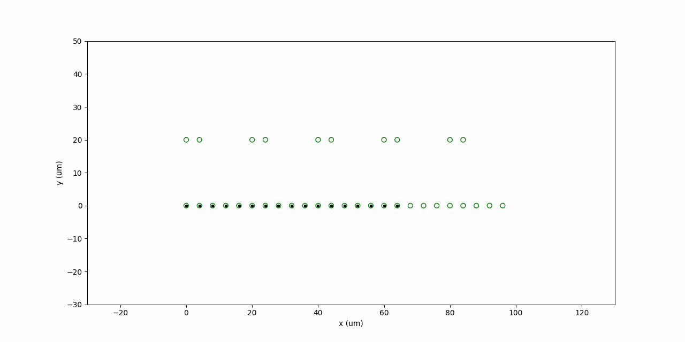
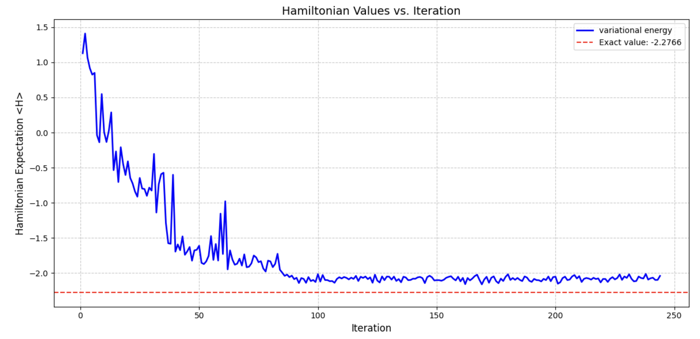
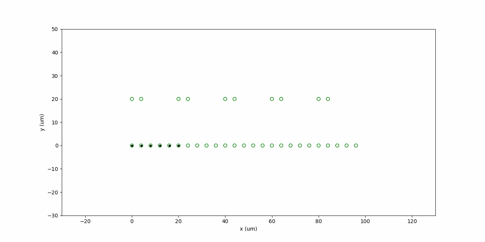

# 2025YaleQHack

This is the soluation of QuBruin team for 2025 Yale Hackathon. We are students from UCLA.

 

Team member: 
John Ye, Hanyu Wang, Harry Wang, Luca Niu, Victor Yu

In this challenge, we explore two different area to demonstrate the power of new language feature, as well as software-hardware codesign. First, we implement error correction code such as repetition code and surface code. With the help of modularized design and function reusing, we show that we can also implement simple logical algorithm with surface code. We also use recursion to implement fault-tolerant syndrome measurement. Second, we implement a second-order Trotterized time evolution simulation of the transverse-field Ising model (TFIM)—a paradigmatic strongly correlated system exhibiting two distinct phases determined by the competition between spin-spin interactions and external transverse fields.By adiabatically tuning the Hamiltonian parameters, our simulations successfully detect the crossing of the critical point separating these phases. Furthermore, we optimize the quantum circuit to minimize the number of required pulses, demonstrating an efficient quantum simulation protocol for the TFIM. We have also put a lot of effort in figuring out the compilation automation pipeline, such that all of our algorithm can be compiled down to atom movements, we also use video to demonstrate our compilation. In the contest, we find some potential bugs in the provided packages. 

## Learning Objectives
By the end of this set of projects, you should be able to:
- Implement quantum error correction codes including repetition codes and surface codes using Kirin's conditional programming features
- Design fault-tolerant measurement circuits using recursive programming techniques in Bloqade
- Simulate the transverse field Ising model using Trotterized evolution to observe quantum phase transitions
- Implement and optimize variational quantum algorithms for finding ground states in multiple physical models
- Apply circuit optimization techniques to maximize gate parallelism for neutral atom quantum hardware
- Design efficient qubit placement and routing solutions for zoned neutral atom architectures
- Visualize quantum algorithms at the hardware level with atom movements and Rydberg operations
- Identify and troubleshooting in quantum programming frameworks

## Video demonstration

As an example, the video below demonstrate the compiled instructions for the 1D zoned architecture, where the gate zone seperation is 20 um and storage zone seperation zone is 4 um. 



More detailed video demonstration can be found in the following links.

Simulation | Toy | QEC | QEC
:-: | :-: | :-: | :-:
[Video1](data/simulation.mp4)| [Video2](data/zac_code_out.mp4) | [Video3](examples/circuit-visualization/surface-code-1-aod.mp4) | [Video4](examples/circuit-visualization/surface-code-4-aod.mp4)


## Writeup
A More in depth description of our submission can be found in this [report](submission/YQuantum_QuBruin_Write_Up.pdf).

The slides of our presentation can be found [here](submission/slides.pdf).

## Environment setup

To reproduce the result, we recommend you to use virtual environment. 

Windows

```bash
cd path\to\your\project
py -m venv yalehack
yalehack\Scripts\activate
pip install -r requirements.txt
```

Mac

```bash
cd path/to/your/project
python3 -m venv yalehack
source yalehack/bin/activate
pip install -r requirements.txt
```


## How to reproduce and learn from our code?

If you want to study and reproduce the QEC part of implementation, everything is included in "submission/qec_submission.ipynb".
If you want to study and reproduce the time dependent ising model part of implementation, everything is included in "submission/time_independent_ising_model.ipynb".


## Getting started

### 1. Implementation Quantum Error Correction with new language feature
[Runnable Jupyter Notebook 1](submission/qec_submission.ipynb) 
We implement surface code, and show a small logical algorithm. Novel syntax features such as if/while and recursion are used in construction of the quantum algorithm.  

### 2. Demonstration of Quantum Simulation: Trotterized Time Evolution and Variational Approach

#### 2.1 Ising Model
[Runnable Jupyter Notebook 2.1](submission/ising_model.ipynb) 

#### 2.2 Schwinger Model
[Runnable Jupyter Notebook 2.2](submit/variational.ipynb) 
 


### 3. Circuit optimization

To run the circuit optimization, you need to specify the qasm file and the optimization method. The qasm file should be in the `./examples/circuit-optimization/qasm/` directory. The optimization method can be one of the following:
- `zx-qiskit`: This method uses ZX calculus to optimize the circuit.
- `qiskit-bloqade-parallel`: This method uses ZX calculus to optimize the circuit and then uses UOpToParallel to optimize the circuit.
- `zx-qiskit-bloqade-parallel`: This method uses UOpToParallel to optimize the circuit.

An example of running the optimization is as follows:
```bash
python ./examples/circuit-optimization/run_optimization.py --qasm_file ./examples/circuit-optimization/qasm/opt-qiskit.qasm --method zx-bloqade-parallel
```


### 4. Circuit visualization

Before running the visualization, one need to perform layout synthesis and get the architecture-specific instructions. An example of such instructions is in `./examples/circuit-visualization/surface-code-1-aod.json`. An example of architecture specification is in `./examples/circuit-visualization/arch-1-aod.json` The json file is generated by ZAC (see `https://github.com/UCLA-VAST/ZAC`). 

As an example, given the quantum circuit below:
```q
OPENQASM 2.0;
include "qelib1.inc";

qreg q[6];
x q[0];
cz q[0],q[1];
cz q[2],q[3];
x q[5];
cz q[0],q[4];
cz q[2],q[5];
```

The corresponding instructions are listed in `./data/toy.json`. Based on the instructions, we can visualize the execution as shown below:


Before running video generation, you need to install ffmpeg. This is required for the animation generation. You can install it using the following commands (for `Ubuntu`):
```bash
sudo apt-get update
sudo apt-get install ffmpeg
```

For Mac, you can use Homebrew:
```bash
brew install ffmpeg
```

Run `./examples/circuit-visualization/animation.py` to visualize the circuit. You may want to change the output file path in the main function to save the animation to a different location. For example:

```bash
python ./examples/circuit-visualization/animation.py --json_file ./examples/circuit-visualization/surface-code-1-aod.json --architecture_file ./examples/circuit-visualization/arch-1-aod.json --mpeg_file ./examples/circuit-visualization/surface-code-1-aod.mp4
```

### 5. Compilation automation (optional)
In previous steps, we have shown how to visualize the circuit and how to optimize the circuit. In this step, we will show how to automate the compilation process. The compilation process includes the following steps:

**Download ZAC** from `https://github.com/UCLA-VAST/ZAC`. After downloading, please install the required packages.

**Prepare the architecture spec**: you need to put your QASM circuit into the `./benchmark` folder in ZAC. For example, the architecture specification used for this project is:
```json
{
    "name": "qhack",
    "operation_duration": {
        "rydberg": 0.36,
        "1qGate": 52,
        "atom_transfer": 15
    },
    "operation_fidelity": {
        "two_qubit_gate": 0.995,
        "single_qubit_gate": 0.9997,
        "atom_transfer": 0.999
    },
    "qubit_spec":{
        "T": 1.5e6
    },
    "storage_zones": [{
        "zone_id": 0,
        "slms": [{
            "id": 0, 
            "site_seperation": [4, 4], 
            "r": 1, 
            "c": 25, 
            "location": [0, 0]}],
        "offset": [0, 0],
        "dimenstion": [300, 200]
    }],
    "entanglement_zones": [{
        "zone_id": 0,
        "slms": [
            {
                "id": 1,
                "site_seperation": [20, 20],
                "r": 1,
                "c": 10,
                "location": [0, 20]
            },
            {
                "id": 2,
                "site_seperation": [20, 20],
                "r": 1,
                "c": 10,
                "location": [4, 20]
            }
        ],
        "offset": [35, 307],
        "dimension": [240, 70]
    }],
    "aods":[
        {"id": 0, "site_seperation": 2, "r": 100, "c": 100}
    ],
    "arch_range": [[0, 0], [100, 20]],
    "rydberg_range": [[[5, 95], [15, 25]]]
}
```

**Prepare the experiment spec**: you need to put your architecture spec into the `./exp_setting` folder in ZAC. For example the specification used for this project is (e.g. in a file named `qhack.json`):
```json
{
    "qasm_list": ["benchmark/surface-code.qasm"],
    "zac_setting": [{
        "arch_spec": "hardware_spec/arch-1-aod.json",
        "dependency": true,
        "dir": "result/zac/test/",
        "routing_strategy": "maximalis_sort",
        "trivial_placement": true,
        "dynamic_placement": false,
        "use_window": true,
        "window_size": 1000,
        "reuse": false,
        "use_verifier": false
    }],
    "simulation": true,
    "animation": false
}
```

Finally, you can run the following command to generate the instructions:
```bash
python run.py exp_setting/qhack.json
```